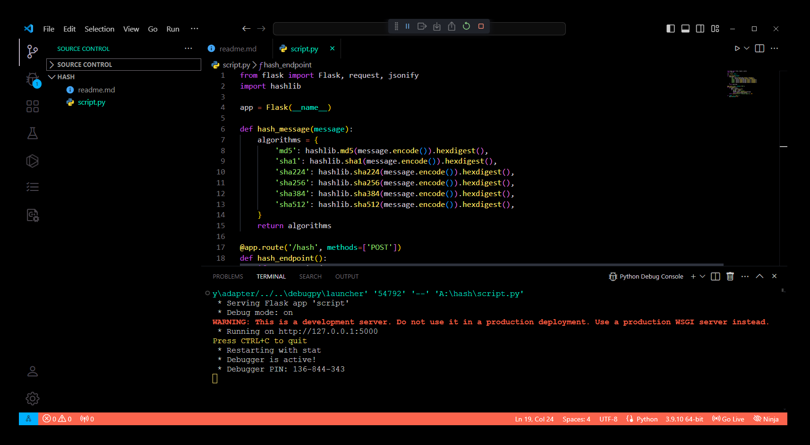

# API de Hashage de Messages

Cette API Flask permet de hasher un message avec différents algorithmes de hachage comme MD5, SHA-1, SHA-224, SHA-256, SHA-384 et SHA-512.

## Endpoints

### `POST /hash`

Cet endpoint permet de soumettre un message à hasher et retourne le résultat hashé pour chaque algorithme spécifié.

### Paramètres de Requête

- **Format de la requête:** JSON
- **Champ requis:**
  - `message`: Le texte à hasher.

### Exemple de Requête

```http
POST /hash HTTP/1.1
Content-Type: application/json

{
    "message": "Hello, World!"
}
```

### Réponse

En réponse à une requête valide avec un message, l'API renverra un JSON contenant les hashs calculés pour chaque algorithme spécifié.

Exemple de réponse :

```json
{
    "md5": "65a8e27d8879283831b664bd8b7f0ad4",
    "sha1": "2ef7bde608ce5404e97d5f042f95f89f1c232871",
    "sha224": "ea09ae9cc6768c50fcee903ed054556e5bfc8347907f12598aa24193",
    "sha256": "c4863f837fef304b9a2f0b9f5b00d8b0f600a8c4ef6eec689d7855551",
    "sha384": "04e35b01d74c92cd03e3b2fcafe5a45c79762e20c94b7f7e6e4fbf86e",
    "sha512": "b89a2e4e1c9c4e14e4cee8e57052d3cda2b79207b2e5d45f2b67c7489"
}
```

### Erreur de Requête

Si la requête est invalide (par exemple, si le champ `message` est manquant dans le JSON), l'API retournera une réponse d'erreur avec un code HTTP 400 (Bad Request).

Exemple de réponse d'erreur :

```json
{
    "error": "Invalid request"
}
```

## Exécution de l'API

Pour exécuter l'API localement :

1. Assurez-vous d'avoir Python et Flask installés.
2. Copiez le code dans un fichier Python (par exemple, `app.py`).
3. Exécutez `python app.py` dans votre terminal.
4. L'API sera accessible à l'adresse `http://localhost:5000`.

## Exemples d'utilisation

Vous pouvez utiliser des outils comme `curl` ou des clients HTTP (comme Postman) pour interagir avec cette API en envoyant des requêtes POST au endpoint `/hash` avec un message JSON contenant un champ `message`.

C'est ainsi que vous pouvez documenter une API Flask simple utilisant Markdown. Assurez-vous d'adapter les détails spécifiques comme le port et les chemins d'accès selon votre configuration.

